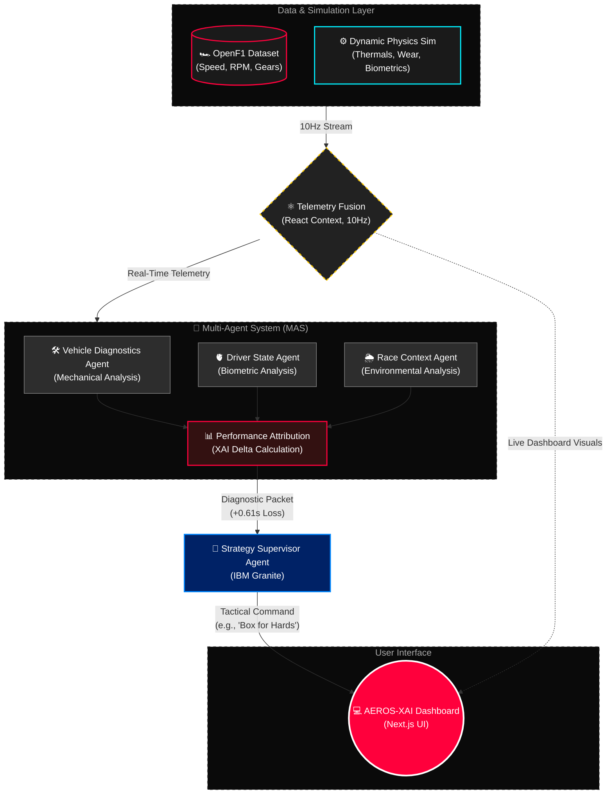

# AEROS-XAI: Autonomous Race Intelligence & Performance Recovery System


> **May Innovation Challenge: Car Racing and AI**  
> *Drive AI beyond the finish line with IBM Granite and explainable performance intelligence.*

**AEROS-XAI** is a Multi-Agent Racing Intelligence Platform designed to identify why racing performance is dropping, quantify the root causes, and recommend actions to recover lost performance in real time. 

Unlike traditional telemetry dashboards that simply visualize data, AEROS-XAI combines vehicle diagnostics, driver intelligence, race context, and strategy analysis into a unified explainable decision system.

---

## 🏎️ The Problem

Modern racing teams generate thousands of telemetry signals every second. These signals include:
- Speed & RPM
- Tire degradation & Brake temperatures
- Fuel consumption
- Driver fatigue & Stress
- Weather conditions & Track grip
- Sector performance

Current systems are excellent at displaying data but often fail to answer the most important question: **Why is performance dropping right now?**

Race engineers are forced to manually correlate multiple systems under extreme time pressure, making it difficult to identify the true cause of performance degradation and react quickly.

---

## 💡 Our Solution: Explainable Race Intelligence

AEROS-XAI introduces **Explainable Race Intelligence**. Using a Multi-Agent System (MAS), specialized AI agents continuously analyze different racing domains and collaborate to identify:
- Why performance is dropping
- Which factors are responsible
- How much impact each factor has
- What actions can recover performance

Instead of simply monitoring the race, AEROS-XAI actively supports performance recovery and strategic decision-making.

### 🎯 Core Innovation: Performance Attribution & Recovery

Most racing systems answer: *What happened?*  
AEROS-XAI answers: **Why did it happen?** and **What should happen next?**

The platform continuously analyzes Vehicle Health, Driver State, Race Context, and Strategic Conditions to produce explainable recommendations.

**Example Analysis:**
- **Performance Loss Detected:** `+0.62 seconds per lap`
- **Root Cause Attribution:**
  - Driver Fatigue → `48%`
  - Tire Degradation → `32%`
  - Brake Temperature Rise → `15%`
  - Track Conditions → `5%`
- **Recommended Actions:**
  - Pit within next 2 laps
  - Switch to Medium Compound
  - Reduce brake aggression
  - Driver hydration intervention
- **Estimated Recovery Potential:** `+0.49 seconds per lap`

This transforms racing analytics from passive monitoring into active performance optimization.

---

## ✨ Key Features

### 📡 Real Telemetry Replay Engine
AEROS-XAI uses OpenF1-compatible telemetry structures to replay real Formula 1 telemetry streams. Available telemetry includes: Speed, RPM, Gear, Throttle, and Brake. Historical telemetry is streamed locally at 10Hz to ensure reliable demonstrations while maintaining realistic racing behavior.

### 🏎️ Vehicle Intelligence
Continuously monitors Engine Temperature, Tire Pressure, Tire Wear, Brake Temperature, Fuel Consumption, Suspension Behavior, and Powertrain Health. The Vehicle Diagnostics Agent identifies mechanical factors contributing to performance degradation.

### 🫀 Driver Intelligence
Analyzes Heart Rate, Body Temperature, Hydration Status, Oxygen Saturation (SpO₂), Breathing Rate, Stress Indicators, Fatigue Indicators, and G-Force Exposure. The Driver State Agent identifies human-performance factors affecting race outcomes.

### 🌦️ Race Context Intelligence
Monitors Track Conditions, Track Grip, Sector Performance, Weather Conditions, and Race Conditions. Provides contextual awareness for strategic decision-making.

### 📊 Performance Attribution Engine
The core innovation of AEROS-XAI. Instead of displaying isolated metrics, the system determines the exact contributors to performance loss.
*(Example: Driver Contribution: 52% | Vehicle Contribution: 35% | Track Contribution: 13%)*  
This allows teams to focus on the highest-impact opportunities for performance recovery.

### 🏁 Strategy Intelligence
Provides Pit Window Recommendations, Tire Strategy Suggestions, Fuel Strategy Analysis, Undercut Opportunities, and Tactical Recommendations. All recommendations are generated through explainable reasoning pipelines.

---

## 🧠 Multi-Agent System (MAS) Architecture

AEROS-XAI follows a modular Multi-Agent System (MAS) architecture distributed across 5 core intelligence engines:

1. **Vehicle Diagnostics Agent**
   - **Responsibilities:** Tire Wear Analysis, Brake Analysis, Engine Health Monitoring, Fuel Efficiency Assessment.
   - **Purpose:** Identify vehicle-related causes of performance degradation.
2. **Driver State Agent**
   - **Responsibilities:** Fatigue Detection, Stress Analysis, Hydration Monitoring, Physical Load Assessment.
   - **Purpose:** Identify driver-related causes of performance degradation.
3. **Race Context Agent**
   - **Responsibilities:** Weather Analysis, Track Condition Assessment, Grip Monitoring, Sector Performance Analysis.
   - **Purpose:** Identify environmental and race-related causes of performance degradation.
4. **Performance Attribution Agent**
   - **Responsibilities:** Root Cause Analysis, Performance Loss Attribution, Recovery Potential Estimation.
   - **Purpose:** Determine why performance is being lost and where improvements can be made.
5. **Strategy Supervisor Agent (Powered by IBM Granite)**
   - **Responsibilities:** Agent Orchestration, Tactical Recommendation Generation, Decision Synthesis.
   - **Purpose:** Combine findings from all agents into a single explainable recommendation.

---

## 🏎️ Hybrid Telemetry & Real-Time Intelligence Architecture

AEROS-XAI utilizes a Hybrid Telemetry Architecture that combines real Formula 1 telemetry with domain-driven simulation models to create a comprehensive race intelligence environment.

### 1. Real Telemetry Ingestion Layer

To ensure realistic racing behavior, AEROS-XAI integrates telemetry structures from the OpenF1 ecosystem.

We acquired historical Formula 1 telemetry data containing authentic:

* Vehicle Speed
* Engine RPM
* Gear Position
* Throttle Input
* Brake Input

The telemetry stream is stored locally and replayed through our Telemetry Engine at **10Hz**, mimicking the behavior of a live telemetry feed.

This architecture allows the platform to:

* Process authentic Formula 1 telemetry patterns
* Eliminate network latency and API dependency during demonstrations
* Ensure consistent and reproducible performance analysis
* Maintain compatibility with future live telemetry integrations

As the replay engine executes, telemetry frames continuously flow through the Multi-Agent System, driving all vehicle intelligence, performance attribution, and strategy analysis modules in real time.

### 2. Vehicle Health Intelligence Modeling

While OpenF1 provides mechanical telemetry, it does not expose internal component health metrics such as:

* Tire Wear
* Tire Degradation
* Brake Health
* Engine Stress
* Fuel Efficiency Trends
* Component Thermal Behavior

To address this limitation, AEROS-XAI includes a Vehicle Health Modeling Layer.

Using real telemetry inputs such as speed, braking intensity, RPM, and acceleration patterns, the system continuously estimates:

* Tire degradation rates
* Brake temperature accumulation
* Thermal stress conditions
* Fuel consumption behavior
* Mechanical performance degradation

These estimations provide the Vehicle Diagnostics Agent with deeper insights than raw telemetry alone.

### 3. Driver Intelligence Modeling

Public motorsport telemetry datasets do not provide access to driver physiological data.

Metrics such as:

* Heart Rate
* Hydration Status
* Stress Levels
* Fatigue Levels
* Breathing Rate
* Oxygen Saturation (SpO₂)
* Cognitive Load

are typically unavailable outside professional racing teams.

To overcome this limitation, AEROS-XAI implements physiological simulation models that dynamically respond to racing conditions.

Driver state is continuously estimated using factors such as:

* Vehicle speed
* Cornering intensity
* G-force exposure
* Session duration
* Braking frequency
* Driving consistency

This enables the Driver State Agent to evaluate human-performance degradation and identify potential performance losses caused by fatigue, stress, or physical overload.

### 4. Real-Time Multi-Agent Processing Pipeline

Every telemetry frame passes through a hierarchy of specialized agents:

**Vehicle Diagnostics Agent**
→ Identifies mechanical performance issues.

**Driver State Agent**
→ Evaluates human-performance degradation.

**Race Context Agent**
→ Analyzes track, weather, and racing conditions.

**Performance Attribution Agent**
→ Determines why lap-time performance is being lost.

**Strategy Supervisor Agent**
→ Synthesizes all findings into explainable race recommendations.

By combining real telemetry data with intelligent simulation models, AEROS-XAI provides a holistic view of racing performance that extends beyond what public telemetry datasets alone can offer.

The result is an explainable race intelligence platform capable of identifying performance loss, attributing root causes, and recommending actions to recover competitive advantage in real time.

---

## 🏗️ Architectural Diagram



---

## Project Structure

```text
AEROS-XAI/
├── src/
│   ├── app/
│   │   ├── globals.css                       # Global stylesheet and Tailwind configuration
│   │   ├── layout.tsx                        # Root layout and global application providers
│   │   ├── page.tsx                          # Marketing Landing Page
│   │   └── (dashboard)/                      # Main Application Dashboard
│   │       ├── layout.tsx                    # Dashboard layout wrapping the Telemetry Context Engine
│   │       ├── context/                      # Race Strategy & Pit Window UI
│   │       ├── driver/                       # Driver Biometric & Cognitive UI
│   │       ├── overview/                     # Explainable AI Performance Attribution UI
│   │       └── vehicle/                      # Vehicle Mechanical Telemetry UI
│   ├── components/
│   │   ├── NavigationSidebar.tsx             # Dashboard side navigation component
│   │   ├── NavigationTopBar.tsx              # Top navigation and routing links
│   │   ├── TopHeader.tsx                     # Real-time top bar displaying live metrics
│   │   └── ui/                               # Reusable primitive UI components
│   ├── context/
│   │   └── TelemetryContext.tsx              # Core 10Hz Simulation Engine & Data Fusion Layer
│   └── lib/
│       ├── mas/                              # Multi-Agent System Architecture
│       │   ├── IBMGraniteStrategySupervisor.ts # Core IBM Granite API integration
│       │   └── agents/
│       │       └── index.ts                  # Consolidated MAS Agents (Vehicle, Driver, Context, Attribution)
│       └── simulation.ts                     # Physics Math Models for Thermals, Wear, and Biometrics
├── public/
│   └── f1_live_telemetry_feed.json           # Cached OpenF1 JSON live telemetry feed for offline 10Hz replay
├── fetch_data.js                             # Node.js script used to cache the OpenF1 live feed
├── next.config.ts                            # Next.js framework configuration
├── package.json                              # Project dependencies and operational scripts
└── tailwind.config.ts                        # Tailwind CSS design system configuration
```

---

## ⚡ Setup & Execution

AEROS-XAI is built using **Next.js 15, React 19, TypeScript, Tailwind CSS, Recharts, and Framer Motion**.

### 1. Prerequisites
Ensure you have [Node.js](https://nodejs.org) (v18.x or later) installed.

### 2. Installation
Clone the repository and install the dependencies:
```bash
git clone https://github.com/Nexorax-nk/AEROS-XAI.git
cd AEROS-XAI
npm install --legacy-peer-deps
```

### 3. Environment Setup (IBM API Keys)
Create a `.env.local` file in the root directory to store your IBM Granite and orchestration API keys securely:

```env
# IBM WatsonX Granite Credentials
WATSONX_APIKEY=your_ibm_cloud_apikey
WATSONX_PROJECT_ID=your_watsonx_project_id
WATSONX_MODEL_ID=ibm/granite-13b-instruct-v2

# (Optional) IBM Docling & Langflow Keys if running external orchestration
DOCLING_KEY=your_docling_key
LANGFLOW_API_KEY=your_langflow_key
```
*(Note: If environment variables are omitted, AEROS-XAI automatically operates in **Simulation Fallback Mode** to ensure the dashboard remains functional for demonstrations).*

### 4. Launch Development Server
```bash
npm run dev
```
Open [http://localhost:3000](http://localhost:3000) in your web browser to access the dashboard.

---

# 🛠️ Technologies & Frameworks

### Frontend & Visualization

* Next.js
* React
* TypeScript
* Tailwind CSS
* Recharts
* Framer Motion

### Data & Telemetry

* OpenF1 Telemetry Dataset
* Real-Time Telemetry Replay Engine
* Vehicle & Driver Simulation Models

### AI & Multi-Agent Architecture

* IBM Granite (Architecture Ready)
* LangChain
* Multi-Agent System (MAS)
* Explainable AI (XAI)
* Performance Attribution Engine

### Deployment

* Vercel
* Single-Package Architecture

---

# 🏆 Built For

**IBM SkillsBuild AI Builders Challenge 2026**

**May Innovation Challenge: AI Beyond the Finish Line**

AEROS-XAI was developed to explore how Explainable AI, Multi-Agent Systems, and real-world telemetry intelligence can transform racing performance analysis from passive monitoring into active performance recovery.

---

# 🚀 Vision

Modern racing generates enormous amounts of data.

Our goal was not to build another telemetry dashboard.

Our goal was to build a system capable of answering:

**Why is performance dropping?**

and

**What should happen next?**

By combining telemetry, driver intelligence, vehicle diagnostics, race context, and explainable decision-making, AEROS-XAI demonstrates how AI can move beyond visualization and become a true performance intelligence platform.

---

# 🙏 Acknowledgements

Special thanks to:

* IBM SkillsBuild
* IBM Granite
* OpenF1
* The Open-Source Community

for providing the tools, datasets, and learning resources that made this project possible.

---

## 🏎️ AEROS-XAI

### Don't just monitor performance.

### Understand it.

### Recover it.

### Optimize it.

**Built with passion, engineering, and AI.**
